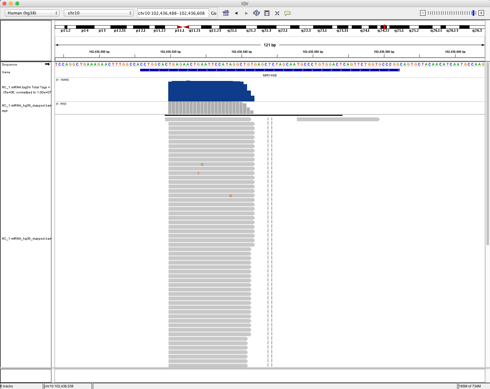

# 2. Construction of expression matrix

-- Yang Eric Li

## 2.0 convert coordinates for bam file

In the last chapter, we use two strategy to align the reads to the genome and different RNA types. As we extract the sequence for each RNA type and mapped reads to them, thus, the coordinates for each reads stored in bam file is not the position of where they aligned to the genome, but the transcripts for each RNA types. We use RSEM \( [https://github.com/deweylab/RSEM](https://github.com/deweylab/RSEM)\) to solve these problem. 

```text
# build bowtie2 index using RSEM
rsem-prepare-reference --gtf /BioII/lulab_b/shared/genomes/human_hg38/gtf/miRNA.gtf --bowtie2 /BioII/lulab_b/shared/genomes/human_hg38/sequence/GRCh38.p12.genome.fa miRNA.indexDir/
# align reads to miRNA
bowtie2 -p 4 --sensitive-local --no-unal --un NC_1.unAligned.fq -x miRNA.indexDir/ NC_1.rRNA_exon.unmapped.fastq -S NC_1.miRNA.sam
# convert the coordinates in bam files
rsem-tbam2gbam miRNA.indexDir/ NC_1.miRNA.sam NC_1.miRNA.rsem.bam
```

## 2.1 Visualization: Genome Broswer

### 2.1.1 Build bedGraph/bigwig files

#### method 1: use BEDtools and UCSC Kent Utilities

```text
# sort bam file
samtools sort NC_1.miRNA.rsem.bam > NC_1.miRNA.sorted.bam
# build bam index
samtools index NC_1.miRNA.sorted.bam
# create bedGraph
bedtools genomecov -ibam NC_1.miRNA.sorted.bam -bga -split -scale 1.0 | sort -k1,1 -k2,2n > NC_1.miRNA.sorted.bedGraph
# convert bedGraph to bigWig
bedGraphToBigWig NC_1.miRNA.sorted.bedGraph /BioII/lulab_b/shared/genomes/human_hg38/sequence/hg38.chrom.sizes NC_1.miRNA.sorted.bw
```

**Note** [http://bedtools.readthedocs.io/en/latest/content/tools/genomecov.html](http://bedtools.readthedocs.io/en/latest/content/tools/genomecov.html)

#### method 2: use homer

* **1.Make tag directories for each experiment**

```text
#works with sam or bam (samtools must be installed for bam)
makeTagDirectory NC_1.miRNA.tagsDir/ NC_1.miRNA.sorted.bam
```

If the experiment is strand specific paired end sequencing, add "-sspe" to the end. If it's unstranded paired-end sequencing, no extra options are needed. makeTagDirectory tags\_Dir/ inputfile.sam -format sam -sspe

* **2.Make bedGraph visualization files for each tag directory**

```text
# Add "-strand separate" for strand-specific sequencing
makeUCSCfile NC_1.miRNA.tagsDir/ -fragLength given -o auto
(repeat for other tag directories)
```

### 2.1.2 Integrative Genomics Viewer\(IGV\)

[https://igv.org/](https://igv.org/)


in our case, try to load the bam and bigwig format file



### 2.1.3 UCSC genome browser

[https://genome.ucsc.edu/](https://genome.ucsc.edu/)


## 2.2 Quantify gene expression

### 2.2.1 Required files

* alignment: bam/sam format

convert sam to bam

```text
samtools view -S -b NC1.miRNA_hg38_mapped.sam > NC1.miRNA_hg38_mapped.bam
```

* annotaion: gtf/gff/gff3 format

convert gff to gtf

```text
gffread tRNA.gff -T -o tRNA.gtf
```

### 2.2.2 count for raw counts

### Tool 1: HTSeq

Given a file with aligned sequencing reads\(.sam/.bam\) and a list of genomic features\(.gtf\), a common task is to count how many reads map to each feature\(gene\).

**Usage**

```text
htseq-count [options] <alignment_files> <gff_file>
```

in our case

```text
htseq-count -m intersection-strict --idattr=Name --type=miRNA_primary_transcript NC_1.miRNA_hg38_mapped.sam /BioII/lulab_b/shared/genomes/human_hg38/gtf/miRNA.gff > NC_1.miRNA.htseq.counts
```

* 3 overlap resolution models

  \*

* We shared our snakemake package used for exRNA-seq expression matrix construction.[Github.](https://github.com/SiqiWang94/Construct_expression_matrix_of_exRNA-seq_data)

**Tips**

* --nonunique
* --nonunique none \(default\): the read \(or read pair\) is counted as ambiguous and not counted for any features. Also, if the read \(or read pair\) aligns to more than one location in the reference, it is scored as alignment\_not\_unique.
* --nonunique all: the read \(or read pair\) is counted as ambiguous and is also counted in all features to which it was assigned. Also, if the read \(or read pair\) aligns to more than one location in the reference, it is scored as alignment\_not\_unique and also separately for each location.
* Notice that when using --nonunique all the sum of all counts will not be equal to the number of reads \(or read pairs\), because those with multiple alignments or overlaps get scored multiple times.

**Notes**

* -m/--mode {mode}
* --nonunique={none/all}
* -s/--stranded {yes/no/reverse}.
* -a {minaqual}.
* -t/--type {feature type}. \(defult: exon\)
* -i/--idattr {id attribute}, GFF attribute to be used as feature ID. \(defult: gene\_id\)

### Tool 2: featureCounts

**Usage**

Summarize a BAM format dataset:

```text
featureCounts -t exon -g gene_id -a annotation.gtf -o counts.txt mapping_results_SE.bam
```

Summarize multiple datasets at the same time:

```text
featureCounts -t exon -g gene_id -a annotation.gtf -o counts.txt library1.bam library2.bam library3.bam
```

in our case

```text
featureCounts -t miRNA_primary_transcript -g Name -a /BioII/lulab_b/shared/genomes/human_hg38/gtf/miRNA.gff -o NC_1.miRNA.featureCounts.counts NC_1.miRNA.sorted.bam
```

**Tips** By default, featureCounts does not count reads overlapping with more than one feature. Users can use the -O option to instruct featureCounts to count such reads \(they will be assigned to all their overlapping features or meta-features\).

### 2.2.2 count for RPKM/FPKM/CPM

* RPKM: Reads Per Kilobase of exon model per Million mapped reads \(每千个碱基的转录每百万映射读取的reads\)
* FPKM: Fragments Per Kilobase of exon model per Million mapped fragments\(每千个碱基的转录每百万映射读取的fragments, 对于Pair-end sequencing, two paired reads should be mapped simultaneously\)

```text
RPKM = total exon reads/ (mapped reads (Millions) * exon length(KB))
```

* RPM/CPM: Reads/Counts of exon model per Million mapped reads \(每百万映射读取的reads\)

```text
RPM=total exon reads / mapped reads (Millions)
```

### Tool: homer

**Usage**

* **0.Align FASTQ reads using STAR or similar 'splicing aware' genome alignment algorithm**
* **1.Make tag directories for each experiment**

```text
#works with sam or bam (samtools must be installed for bam)
makeTagDirectory Exp1r1/ inputfile1r1.sam -format sam
makeTagDirectory Exp1r2/ inputfile1r2.sam -format sam
```

If the experiment is strand specific paired end sequencing, add "-sspe" to the end. If it's unstranded paired-end sequencing, no extra options are needed. makeTagDirectory Exp1/ inputfile.sam -format sam -sspe

* **2. Quantify gene expression across all experiments for clustering and reporting \(-rpkm / -rpm / -log2 / -quantile / -sqrt\):**

```text
# May also wish to use "-condenseGenes" if you don't want multiple isoforms per gene
analyzeRepeats.pl rna hg38 -strand both -count exons -d Exp1r1/ Exp1r2 Exp2r1/ Exp2r2/ -rpkm > rpkm.txt
# Use this result for gene expression clustering, PCA, etc.
```

* **3. Quantify gene expression as integer counts for differential expression \(-noadj\)**

```text
# May also wish to use "-condenseGenes" if you don't want multiple isoforms per gene
analyzeRepeats.pl rna hg38 -strand both -count exons -d Exp1r1/ Exp1r2 Exp2r1/ Exp2r2/ -noadj > raw.txt
```

in our case

```text
makeTagDirectory NC_1.miRNA.tagsDir/ NC_1.miRNA.sorted.bam
# raw counts
analyzeRepeats.pl /BioII/lulab_b/shared/genomes/human_hg38/gtf/miRNA.gtf hg38 -count exons -d NC_1.miRNA.tagsDir/ -noadj > NC_1.miRNA.homer.counts
# calculate rpkm
analyzeRepeats.pl /BioII/lulab_b/shared/genomes/human_hg38/gtf/miRNA.gtf hg38 -count exons -d NC_1.miRNA.tagsDir/ -rpkm > NC_1.miRNA.homer.rpkm
# calculate rpm/cpm
analyzeRepeats.pl /BioII/lulab_b/shared/genomes/human_hg38/gtf/miRNA.gtf hg38 -count exons -d NC_1.miRNA.tagsDir/ -norm 1e7 > NC_1.miRNA.homer.rpm
```

**Tips:** in default, homer do not use gff format file but gtf format. look into the difference between: 

/BioII/lulab\_b/shared/genomes/human\_hg38/gtf/miRNA.gtf /BioII/lulab\_b/shared/genomes/human\_hg38/gtf/miRNA.gff

### 2.2.3 count for TPM

TPM：Transcripts Per Kilobase of exon model per Million mapped reads \(每千个碱基的转录每百万映射读取的Transcripts\)

```text
TPMi=(Ni/Li)*1000000/sum(Ni/Li+……..+ Nm/Lm)
```

Merge expression matrix of different RNA types together, then convert RPKM to TPM.

```text
cat NC_1.miRNA.homer.rpkm NC_1.piRNA.homer.rpkm NC_1.Y_RNA_exon.homer.rpkm NC_1.snRNA.homer.rpkm NC_1.srpRNA_exon.homer.rpkm NC_1.tRNA.homer.rpkm NC_1.lncRNA_exon.homer.rpkm NC_1.mRNA_exon.homer.rpkm | grep -v "Transcript" | cut -f 1-6,9 | sed -e "1i geneID\tchr\tstart\tend\tstrand\tLength\tRPKM" > NC_1.merge.homer.rpkm.tsv
```

R script: 

```text
# Convert RPKM to transcripts per million (TPM).
> mx <- read.table("NC_1.merge.homer.rpkm.tsv",head=T,sep="\t")
> mx$TPM <- mx$RPKM/sum(mx$RPKM)*10^6
> head(mx)
     geneID   chr     start       end strand Length    RPKM       TPM
1 MI0014230 chr18  14830166  14830242      +     76   0.000 0.0000000
2 MI0017288  chr8   9048445   9048518      +     73   5.675 0.3932538
3 MI0022961  chr3 123161794 123161879      +     85  14.622 1.0132436
4 MI0003616 chr10  24275685  24275781      +     96   0.000 0.0000000
5 MI0017866  chr2  75090812  75090914      +    102   4.062 0.2814797
6 MI0000762  chrX  50008964  50009028      +     64 139.173 9.6441082
> mx <- read.table("foo",head=T,sep="\t")
> head(mx)
     geneID   chr     start       end strand Length    RPKM
1 MI0014230 chr18  14830166  14830242      +     76   0.000
2 MI0017288  chr8   9048445   9048518      +     73   5.675
3 MI0022961  chr3 123161794 123161879      +     85  14.622
4 MI0003616 chr10  24275685  24275781      +     96   0.000
5 MI0017866  chr2  75090812  75090914      +    102   4.062
6 MI0000762  chrX  50008964  50009028      +     64 139.173
> mx$TPM <- mx$RPKM/sum(mx$RPKM)*10^6
> head(mx)
     geneID   chr     start       end strand Length    RPKM       TPM
1 MI0014230 chr18  14830166  14830242      +     76   0.000 0.0000000
2 MI0017288  chr8   9048445   9048518      +     73   5.675 0.3932538
3 MI0022961  chr3 123161794 123161879      +     85  14.622 1.0132436
4 MI0003616 chr10  24275685  24275781      +     96   0.000 0.0000000
5 MI0017866  chr2  75090812  75090914      +    102   4.062 0.2814797
6 MI0000762  chrX  50008964  50009028      +     64 139.173 9.6441082
```


### 2.2.4 Merge to expression matrix

use linux command \(cut, awk, sed, paste...\) generate expression matrix

use homer:

```text
analyzeRepeats.pl /BioII/lulab_b/shared/genomes/human_hg38/gtf/miRNA.gtf hg38 \
-d NC_1.miRNA.tagsDir/ NC_2.miRNA.tagsDir/ NC_3.miRNA.tagsDir/ \
BeforeSurgery_1.miRNA.tagsDir/ BeforeSurgery_2.miRNA.tagsDir/ BeforeSurgery_3.miRNA.tagsDir/ \
AfterSurgery_1.miRNA.tagsDir/ AfterSurgery_2.miRNA.tagsDir/ AfterSurgery_3.miRNA.tagsDir/ \
-noadj > hcc_example.miRNA.homer.ct.tsv

cut -f 1,9- $path0/04.counts/hcc_example.homer.ct.tsv $path0/04.counts/hcc_example.homer.ct.mx
# manually modify the header
# geneID    NC_1    NC_2    NC_3    BeforeSurgery_1 BeforeSurgery_2 BeforeSurgery_3 AfterSurgery_1  AfterSurgery_2  AfterSurgery_3
# hsa-mir-1295a   0.000   1.000   0.000   6.000   11.000  5.000   1.000   18.000  3.000
# hsa-mir-1248    6.000   15.000  5.000   49.000  4.000   63.000  118.000 22.000  81.000
# hsa-mir-130b    127.000 118.000 146.000 148.000 336.000 167.000 92.000  129.000 352.000
# hsa-mir-3142    1.000   0.000   0.000   0.000   0.000   0.000   0.000   0.000   0.000
# hsa-mir-541     2.000   0.000   4.000   1.000   21.000  0.000   0.000   0.000   2.000
```

## 2.3 Cleaning the expression matrix

### load expression matrix

```text
# R script
> mx <- read.table("hcc_example.miRNA.homer.ct.mx",sep="\t",header=T)
> head(mx[,1:5])
          geneID NC_1 NC_2 NC_3 BeforeSurgery_1
1  hsa-mir-1295a    0    1    0               6
2   hsa-mir-1248    6   15    5              49
3   hsa-mir-130b  127  118  146             148
4   hsa-mir-3142    1    0    0               0
5    hsa-mir-541    2    0    4               1
6 hsa-mir-3130-2    5    7   11               2
```

### check the library size

```text
> colSums(mx[,2:ncol(mx)])
           NC_1            NC_2            NC_3 BeforeSurgery_1 BeforeSurgery_2
        3822770         3113065         4155202         7187702         5865615
BeforeSurgery_3  AfterSurgery_1  AfterSurgery_2  AfterSurgery_3
        5015987         4455862         7848293         3167270
```

### check total detected genes

```text
> apply(mx[,2:ncol(mx)], 2, function(c)sum(c!=0))
           NC_1            NC_2            NC_3 BeforeSurgery_1 BeforeSurgery_2
            883             868             881             865             989
BeforeSurgery_3  AfterSurgery_1  AfterSurgery_2  AfterSurgery_3
            910             848             915             951
```

### filter genes

**Purpose** Filtering low-expression genes improved DEG detection sensitivity. 

**Methods**

* Filter the genes with a total counts &lt; = threshold;
* Filter genes with maximum normalized counts across all samples &lt; = threshold;
* Filter genes with mean normalized counts across all samples &lt; = threshold.

**Criteria** Retain genes: \(Reads &gt;= 1 counts\) &gt;= 20% samples.

```text
> filter_genes <- apply(
+ mx[,2:ncol(mx)],
+ 1,
+ function(x) length(x[x > 2]) >= 2
+ )

> mx_filterGenes <- mx[filter_genes,]
```

### check correlations between samples

```text
> cor.test(mx_filterGenes$NC_1,mx_filterGenes$NC_2,methods="spearman")
> pairs(~NC_1+NC_2+NC_3,data=mx_filterGenes)
> dev.off()
```


## Scripts summary

* build bedGraph/bigWig for visualization

  ```text
  ## 1.1 use BEDtools and UCSC Kent Utilities
  samtools sort NC_1.miRNA.rsem.bam > NC_1.miRNA.sorted.bam
  samtools index NC_1.miRNA.sorted.bam
  bedtools genomecov -ibam NC_1.miRNA.sorted.bam -bga -split -scale 1.0 | sort -k1,1 -k2,2n > NC_1.miRNA.sorted.bedGraph
  bedGraphToBigWig NC_1.miRNA.sorted.bedGraph /BioII/lulab_b/shared/genomes/human_hg38/sequence/hg38.chrom.sizes NC_1.miRNA.sorted.bw

  ## 1.2 use homer
  makeTagDirectory NC_1.miRNA.tagsDir/ NC_1.miRNA.sorted.bam
  makeUCSCfile NC_1.miRNA.tagsDir/ -fragLength given -o auto
  ```

* count for expression value

  ```text
  # using HTSeq
  samtools view NC_1.miRNA.rsem.bam > NC_1.miRNA.rsem.sam
  htseq-count -m intersection-strict --idattr=Name --type=miRNA_primary_transcript NC_1.miRNA.rsem.sam /BioII/lulab_b/shared/genomes/human_hg38/gtf/miRNA.gff > NC_1.miRNA.htseq.counts
  # using featureCounts
  featureCounts -t miRNA_primary_transcript -g Name -a /BioII/lulab_b/shared/genomes/human_hg38/gtf/miRNA.gff -o NC_1.miRNA.featureCounts.counts NC_1.miRNA.sorted.bam
  # using homer
  analyzeRepeats.pl /BioII/lulab_b/shared/genomes/human_hg38/gtf/miRNA.gtf hg38 -count exons -d NC_1.miRNA.tagsDir/ -noadj > NC_1.miRNA.homer.countsa
  ```

* generate expression matrix

  ```text
  # use homer
  analyzeRepeats.pl /BioII/lulab_b/shared/genomes/human_hg38/gtf/miRNA.gtf hg38 \
  -d NC_1.miRNA.tagsDir/ NC_2.miRNA.tagsDir/ NC_3.miRNA.tagsDir/ \
  BeforeSurgery_1.miRNA.tagsDir/ BeforeSurgery_2.miRNA.tagsDir/ BeforeSurgery_3.miRNA.tagsDir/ \
  AfterSurgery_1.miRNA.tagsDir/ AfterSurgery_2.miRNA.tagsDir/ AfterSurgery_3.miRNA.tagsDir/ \
  -noadj > hcc_example.miRNA.homer.ct.tsv
  ```

* cleaning the expression matrix

```text
# R script
> mx <- read.table("hcc_example.miRNA.homer.ct.mx",sep="\t",header=T)
> head(mx[,1:5])
          geneID NC_1 NC_2 NC_3 BeforeSurgery_1
1  hsa-mir-1295a    0    1    0               6
2   hsa-mir-1248    6   15    5              49
3   hsa-mir-130b  127  118  146             148
4   hsa-mir-3142    1    0    0               0
5    hsa-mir-541    2    0    4               1
6 hsa-mir-3130-2    5    7   11               2

# check library size (total mapped reads)
> colSums(mx[,2:ncol(mx)])
           NC_1            NC_2            NC_3 BeforeSurgery_1 BeforeSurgery_2
        3822770         3113065         4155202         7187702         5865615
BeforeSurgery_3  AfterSurgery_1  AfterSurgery_2  AfterSurgery_3
        5015987         4455862         7848293         3167270

# check the number of detected genes
> apply(mx[,2:ncol(mx)], 2, function(c)sum(c!=0))
           NC_1            NC_2            NC_3 BeforeSurgery_1 BeforeSurgery_2
            883             868             881             865             989
BeforeSurgery_3  AfterSurgery_1  AfterSurgery_2  AfterSurgery_3
            910             848             915             951

# filter genes
> filter_genes <- apply(
+ mx[,2:ncol(mx)],
+ 1,
+ function(x) length(x[x > 2]) >= 2
+ )

> mx_filterGenes <- mx[filter_genes,]
> head(mx_filterGenes[,1:5])
          geneID NC_1 NC_2 NC_3 BeforeSurgery_1
1  hsa-mir-1295a    0    1    0               6
2   hsa-mir-1248    6   15    5              49
3   hsa-mir-130b  127  118  146             148
5    hsa-mir-541    2    0    4               1
6 hsa-mir-3130-2    5    7   11               2
7    hsa-mir-369 3506 1117 2086              12

# check the correlations between each samples
> cor.test(mx_filterGenes$NC_1,mx_filterGenes$NC_2,methods="spearman")

	Pearson's product-moment correlation

data:  mx_filterGenes$NC_1 and mx_filterGenes$NC_2
t = 33.508, df = 863, p-value < 2.2e-16
alternative hypothesis: true correlation is not equal to 0
95 percent confidence interval:
 0.7214444 0.7795271
sample estimates:
      cor
0.7519414

> pairs(~NC_1+NC_2+NC_3,data=mx_filterGenes)
> dev.off()

# save the results
write.table(mx_filterGenes,"hcc_example.miRNA.homer.ct.filtered.mx",sep="\t",quote=F,col.names=T,row.names=F)
```

## Homeworks

#### scripts and files:

[**https://github.com/lulab/training/tree/master/proj\_exRNA/example\_small/constructExpMx**](https://github.com/lulab/training/tree/master/proj_exRNA/example_small/constructExpMx)

cnode: /BioII/lulab\_b/shared/shared\_scripts/bioinfoTraining/constructExpMx

**Level I:** 

1. learn how to construct the expression matrix. 

2. compare the difference between HTSeq, featureCounts and homer 

3. check the bam/bigWig file using IGV 

4. QC and cleaning the expression matrix

**Level II:** 

**reference scripts:** cnode: /home/younglee/projects/hcc\_example/bin

1. convert bam/sam files coordinates to genome coordinates \(for sequential mapping\) 

2. construct expression matrix for all RNA types \(miRNA, piRNA, mRNA, lncRNA...\) 

3. QC and cleaning the expression matrix

**Level III:**

quantify miRNA using bam files from common \(map to hg38 genome directly\) and sequential mapping \(map to multiple RNA types\), respectively. 

Compare the differences and explain why. \(using RSEM: [https://github.com/deweylab/RSEM](https://github.com/deweylab/RSEM), please check _rsem-prepare-reference_ and _rsem-tbam2gbam_ functions\)


