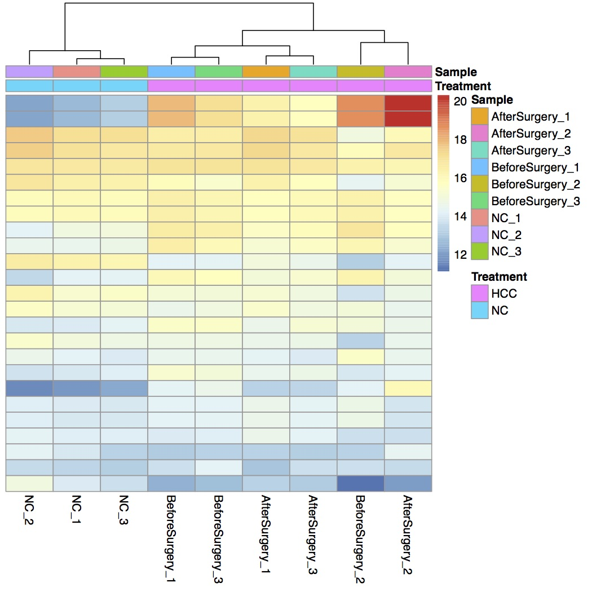
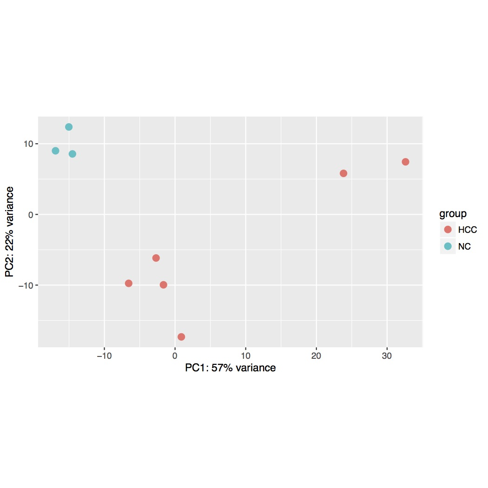
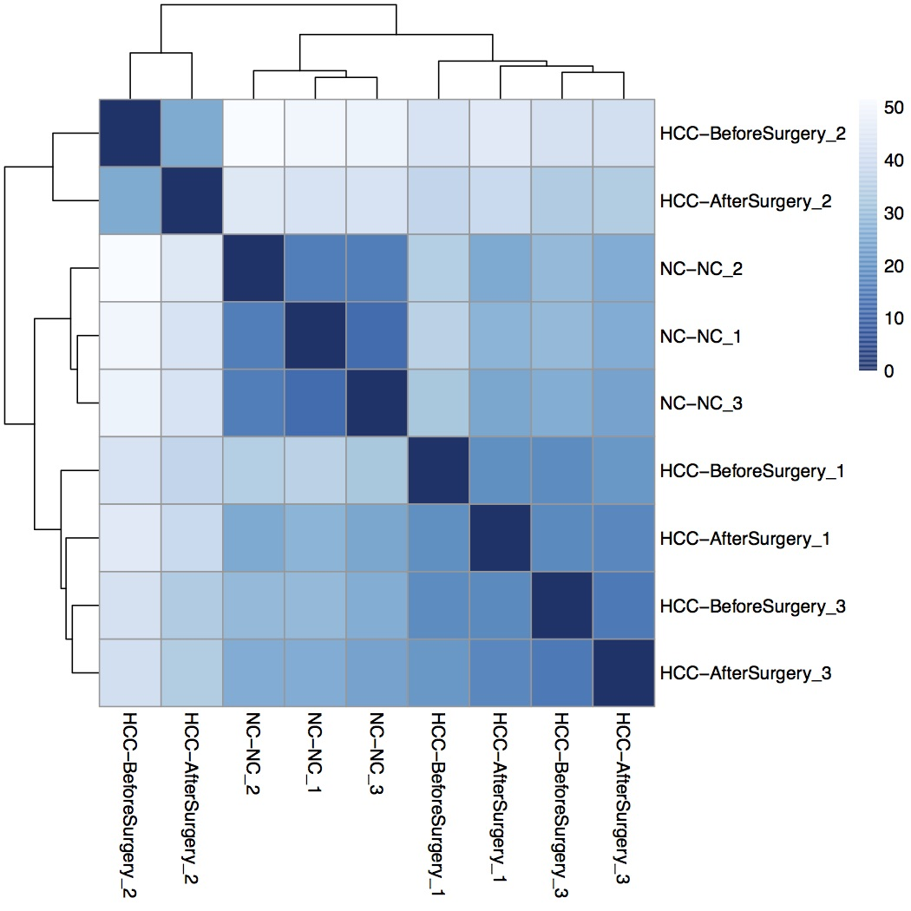
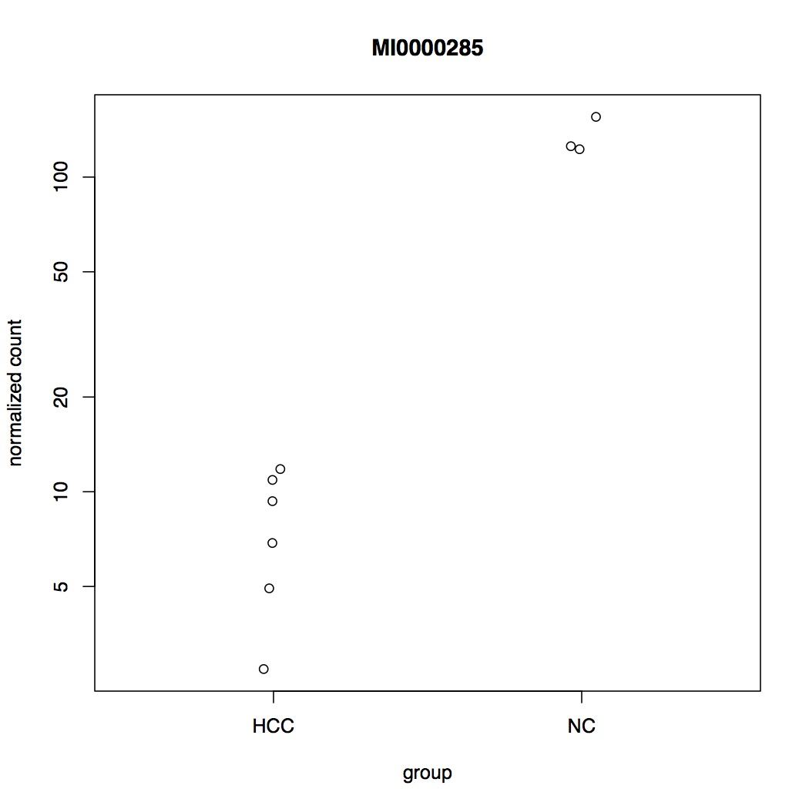
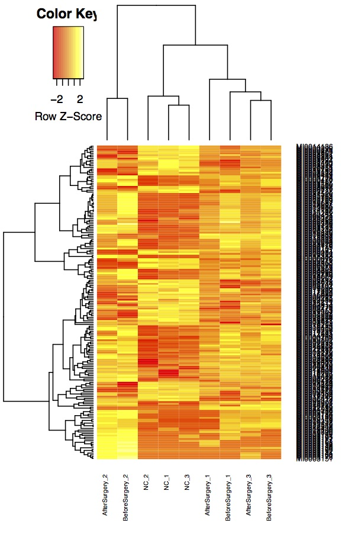

# 3. Differential Expression Analysis & Exploring

-- Yang Eric Li

### **Aim for this section**

One of the most common types of analyses when working with bulk RNA-seq data is to identify differentially expressed genes. By comparing the genes that change between two conditions. For example in our case, the two conditions should be the normal and cancer patients. Several different methods, e.g. DESeq2 and edgeR, have been developed for RNA-seq.

During the differential expression analysis, we exploring the similarities and dissimilarities between samples and visualizing differential expressed genes.

## 3.1 Normalization

### 3.1.1 widly used quantifies

* raw counts
* RPKM: Reads Per Kilobase of exon model per Million mapped reads \(每千个碱基的转录每百万映射读取的reads\)
* FPKM: Fragments Per Kilobase of exon model per Million mapped fragments\(每千个碱基的转录每百万映射读取的fragments, 对于Pair-end sequencing, two paired reads should be mapped simultaneously\)

```text
RPKM = total exon reads/ (mapped reads (Millions) * exon length(KB))
```

* TPM：Transcripts Per Kilobase of exon model per Million mapped reads \(每千个碱基的转录每百万映射读取的Transcripts\)

```text
TPMi=(Ni/Li)*1000000/sum(Ni/Li+……..+ Nm/Lm)
```

* RPM/CPM: Reads/Counts of exon model per Million mapped reads \(每百万映射读取的reads\)

```text
RPM=total exon reads / mapped reads (Millions)
```

### 3.1.2 Relative vs absolute expression

As shown above, we have been estimating the relative abundance, i.e. what proportion of transcripts in a sample belong to a particular isoform. Can we estimate the absolute abundance from RNA-Seq data?

Consider the two cells drawn below. The colored squiggly lines represent individual transcripts of the corresponding isoforms.


Cell B has twice as many transcripts of each isoform as cell A. If we conduct RNA-Seq experiments in the two cells, we would get samples from essentially the same distribution. We wouldn’t be able to tell the cells apart based on their RNA-Seq.

Here’s a trick: during library preparation, we add a known amount of an artificial RNA or DNA that is not produced by the studied organism \(the blue squiggle below\), then we can compare all abundances against it. This artificially introduced material is called a spike-in.


If we regard the spike-in as isoform 0, with the known absolute abundance of T0 transcripts, then the absolute abundance of isoform i can be estimated as:

Ti = T0 \* \(RPMi / RPM0\)

Whether we care about absolute or relative expression depends on the biological question in hand. However, looking at relative expression alone can produce unexpected results.

Suppose again that only two isoforms are being expressed, red and yellow. In condition A, the two isoforms are equally expressed. In condition B, the yellow isoform’s expression doubles, while the red isoform’s expression is not affected at all.


Now let’s look at the relative expression:


Based on this chart, we might conclude that the red isoform is also differentially expressed between the two conditions. Technically this is true, as long as we are talking about relative expression, but this is only a consequence of the overexpression of the yellow isoform.

**Notes**

* Selecting Between-Sample RNA-Seq Normalization Methods from the Perspective of their Assumptions

  [link](https://arxiv.org/pdf/1609.00959v1.pdf)

* Marie-Agnès Dillies, et al. A comprehensive evaluation of normalization methods for Illumina high-throughput RNA sequencing data analysis. Briefings in Bioinformatics, Volume 14, Issue 6, 1 November 2013, Pages 671–683 [link](https://academic.oup.com/bib/article/14/6/671/189645)
* Catalina A Vallejos, et al. Normalizing single-cell RNA sequencing data: challenges and opportunities. Nature Methods volume 14, pages 565–571 [link](https://www.nature.com/articles/nmeth.4292)

## 3.2 Models of RNA-seq data

### 3.2.1 negative binomial model

The most common model of RNA-seq data is the negative binomial model:

```text
set.seed(1)
hist(
    rnbinom(
        1000,
        mu = 10,
        size = 100),
    col = "grey50",
    xlab = "Read Counts",
    main = "Negative Binomial"
)
```


Mean: **μ = mu**

Variance: **σ2 = mu + mu2/size**

It is parameterized by the mean expression \(mu\) and the dispersion \(size\), which is inversely related to the variance.

### 3.2.2 possion models

In possion distribution, which presumes the variance and mean \[ ie. expression in our case\] are equal.

```text
hist(
    rpois(1000, 10),
    col = "grey50",
    xlab = "Read Counts",
    main = "Possion"
)
```


Mean: **μ = mu**

Variance: **σ2 = mu **

### 3.2.3 zero-inflated negative binomial models

A raw negative binomial model does not fit full-length transcript data as well due to the high dropout rates relative to the non-zero read counts.

```text
d <- 0.5;
counts <- rnbinom(
    1000,
    mu = 10,
    size = 100
)
counts[runif(1000) < d] <- 0
hist(
    counts,
    col = "grey50",
    xlab = "Read Counts",
    main = "Zero-inflated NB"
)
```


## 3.3 Commonly used test and tools

### **3.3.0 requirements**

To preform differential expression analysis, we usually need two files:

| **file 1: **expression matrix | raw counts, rpkm, rpm for each gene and samples |
| --- | --- |
| **file 2: **experimental design | the experimental design or conditions for each samples |

the expression matrix looks like:

```text
#     geneID NC_1 NC_2 NC_3 BeforeSurgery_1
#  MI0016824    0    0    0               3
#  MI0017385    9    5   10              16
#  MI0016429    6    8    1               1
#  MI0003676 1021  197  713              35
#  MI0025922    3    1    3               8
#  MI0016849    1    1    2               3
```

the experimental design looks like:

```text
# Sample  Treatment
# NC_1    NC
# NC_2    NC
# NC_3    NC
# BeforeSurgery_1 HCC
# BeforeSurgery_2 HCC
# BeforeSurgery_3 HCC
# AfterSurgery_1  HCC
# AfterSurgery_2  HCC
# AfterSurgery_3  HCC
```

DESeq and EdgeR are very similar and both assume that no genes are differentially expressed. DEseq uses a 'geometric' normalisation strategy, whereas EdgeR is a log-based method. Both normalise data initially via the calculation of size and normalisation factors, respectively.

### 3.3.1 DESeq2

The package DESeq2 provides methods to test for differential expression by use of negative binomial generalized linear models **Usage**

```text
# filter expression matrix
mx <- read.table("hcc_example.miRNA.homer.ct.mx",sep="\t",header=T)

# filter genes
filter_genes <- apply(
    mx[,2:ncol(mx)],
    1,
    function(x) length(x[x > 2]) >= 2
)

mx_filterGenes <- mx[filter_genes,]

# load experimential design
design <- read.table("design.tsv",sep="\t",header=T)

#-----------------------------------------
# basic script for normalizing with DESeq2
library(DESeq2)
#Read Data in
countData <- mx_filterGenes
colData <- design

# generate Dataset
dds <- DESeqDataSetFromMatrix(countData, colData, design=~Treatment, tidy=TRUE)

# normlize using rlog mathod
norm <- rlog(dds,blind=FALSE)
norm_matrix <- assay(norm)
norm_df <- data.frame(Gene=rownames(norm_matrix), norm_matrix)
write.table(norm_df, "hcc_example.miRNA.homer.DESeq2.rlog.mx", row.names = FALSE,sep="\t")

deg <- DESeq(dds)
res <- results(deg,tidy=TRUE)
merged_res <- merge(norm_df,res,by.x="Gene",by.y="row")
write.table(merged_res,file="hcc_example.miRNA.NCvsHCC.DESeq2.tsv",sep="\t",row.names=FALSE)
```

**Tips** [Analyzing RNA-seq data with DESeq2](http://bioconductor.org/packages/devel/bioc/vignettes/DESeq2/inst/doc/DESeq2.html)

**Notes**

> We shared scripts on github.
>
> * DESeq2 normalization: R package DESeq2.[Github.](https://github.com/lulab/training/blob/master/proj_exRNA/example_small/diffexp.DESeq2.R)

### 3.3.2 edgeR

**Usage**

```text
# 0.filter expression matrix
mx <- read.table("hcc_example.miRNA.homer.ct.mx",sep="\t",header=T)

# filter genes
filter_genes <- apply(
    mx[,2:ncol(mx)],
    1,
    function(x) length(x[x > 2]) >= 2
)

mx_filterGenes <- mx[filter_genes,]

# load experimential design
design <- read.table("design.tsv",sep="\t",header=T)

#--------------------------------
# basic script for running edgeR
library(edgeR)
#Read Data in
countData <- mx_filterGenes[,-1]
rownames(countData) <- mx_filterGenes[,1]
design <- read.table("design.tsv",sep="\t",header=T)
colData <- design

# generate DGE object
y <- DGEList(countData, samples=colData, group=colData$Treatment)
y <- calcNormFactors(y)

#Estimate Error Model
design <-model.matrix(~Treatment, data=colData)
y <- estimateDisp(y, design)

# classic methods: compute p-values, then output
et <- exactTest(y)
res <- topTags(et,Inf)
tidyResult <- data.frame(Gene=rownames(res$table), res$table)
write.table(tidyResult,file="hcc_example.miRNA.NCvsHCC.edgeR.classic.tsv",sep="\t",row.names=FALSE)

# Generalized linear models
fit <- glmFit(y,design)
# likelihood ratio test
lrt <- glmLRT(fit,contrast = c(1,-1))
FDR <- p.adjust(lrt$table$PValue, method="BH")
padj_lrt <- cbind(lrt$table,FDR)
fit_df <- lrt$fitted.values
write.table(fit_df,file = "hcc_example.miRNA.homer.edgeR.TMM.mx",row.names = T, sep="\t", quote=F)
merged_lrt <- merge(fit_df,padj_lrt,by="row.names")
colnames(merged_lrt)[1] <- "Genes"
write.table(merged_lrt,file = "hcc_example.miRNA.NCvsHCC.edgeR.tsv",row.names = F, sep="\t", quote=F)
```

**Tips** [edgeR Users Guide](https://www.bioconductor.org/packages/devel/bioc/vignettes/edgeR/inst/doc/edgeRUsersGuide.pdf)

**Notes**

> We shared scripts on github.
>
> * TMM normalization: R package edgeR.[Github.](https://github.com/lulab/training/blob/master/proj_exRNA/example_small/diffexp.edgeR.R)

### 3.3.3 using homer 

Calculate differential expression \(requires R/Bioconductor and the package edgeR to be installed!!\)  
\# Name the samples in the same order as they were used in the analyzeRepeats.pl command.  
\# Replicates should have the same name \(i.e. cond1\)  
**getDiffExpression.pl raw.txt cond1 cond1 cond2 cond2 &gt; diffExp.output.txt**

```text
getDiffExpression.pl hcc_example.miRNA.homer.ct.tsv NC NC NC HCC HCC HCC HCC HCC HCC -repeats -DESeq2 > hcc_example.miRNA.NCvsHCC.homer.DESeq2.tsv
getDiffExpression.pl hcc_example.miRNA.homer.ct.tsv NC NC NC HCC HCC HCC HCC HCC HCC -repeats -edgeR > hcc_example.miRNA.NCvsHCC.homer.edgeR.tsv
```

### 3.3.4 Wilcox/Mann-Whitney-U Test

**Usage** 1. normalize the reads by library size \(edgeR\) 2. identify differential expressed gene using wilcoxon.test\(\)

```text
cpmMx <- read.table("hcc_example.miRNA.homer.rpm.mx",sep="\t",header=T)
filter_cpm <- apply(
    mx[,2:ncol(cpmMx)],
    1,
    function(x) length(x[x > 0]) >= 2
)
mx_filterCPM <- cpmMx[filter_cpm,]

myFun <- function(x){
  x = as.numeric(x)
  v1 = x[2:4]
  v2 = x[5:10]
  out <- wilcox.test(v1,v2)
  out <- out$p.value
}
p_value <- apply(mx_filterCPM,1,myFun)
p_value[is.nan(p_value)] <- 1
FDR <- p.adjust(p_value,method = "BH")
mx_filterCPM$avgNC <- apply(foo[,2:4],1,mean)
mx_filterCPM$avgHCC <- apply(foo[,5:10],1,mean)
mx_filterCPM$log2fc <- log2((foo$avgNC+0.25)/(foo$avgHCC+0.25))
results <- cbind(mx_filterCPM,p_value,FDR)
write.table(results,file = "hcc_example.miRNA.NCvsHCC.wilcox.tsv",row.names = F, sep="\t", quote=F)
```

> We shared scripts on github.
>
> * RPM normalization: R package edgeR to calculate RPM, then test by R function wilcoxon.test\(\).[Github.](https://github.com/lulab/training/blob/master/proj_exRNA/example_small/diffexp.wilcox.R)

## 3.4 Exploring the results

Taking results from DESeq2 as an example, we exploring the similarities and dissimilarities between samples and differential expressed genes

```text
library(DESeq2)
#Read Data in
countData <- mx_filterGenes
colData <- design

# generate Dataset object
dds <- DESeqDataSetFromMatrix(countData, colData, design=~Treatment, tidy=TRUE)

# normlize using rlog mathod
norm <- rlog(dds,blind=FALSE)
norm_matrix <- assay(norm)

# diff-exp analysis using DESeq2
deg <- DESeq(dds)
res <- results(deg,tidy=TRUE)
```

### Heatmap for count matrix

we use heatmap to explore the normalized count matrix

```text
library("pheatmap")
select <- order(rowMeans(counts(deg,normalized=TRUE)), decreasing=TRUE)[1:25]
df <- as.data.frame(colData(deg)[,c("Treatment","Sample")])
pheatmap(assay(norm)[select,], cluster_rows=FALSE, show_rownames=FALSE, cluster_cols=TRUE, annotation_col=df)
dev.off()
```



### PCA analysis

PCA is useful for visualizing the overall effect of experimental covariates and batch effects.

```text
plotPCA(norm, intgroup=c("Treatment"))
dev.off()
```



### check distance between samples

we apply the _dist_ function to the transpose of the transformed count matrix to get sample-to-sample distances.

```text
sampleDists <- dist(t(assay(norm)))
```

A heatmap of this distance matrix gives us an overview over similarities and dissimilarities between samples.

```text
library("RColorBrewer")
sampleDistMatrix <- as.matrix(sampleDists)
rownames(sampleDistMatrix) <- paste(norm$Treatment, norm$Sample, sep="-")
colnames(sampleDistMatrix) <- paste(norm$Treatment, norm$Sample, sep="-")
colors <- colorRampPalette( rev(brewer.pal(9, "Blues")) )(255)
pheatmap(sampleDistMatrix,
         clustering_distance_rows=sampleDists,
         clustering_distance_cols=sampleDists,
         col=colors)
```



### MA-plot

Based on the differential expression results, we use **MA-plot** to explore the log2 fold changes attributable to a given variable over the mean of normalized counts for all the samples

```text
plotMA(deg, ylim=c(-5,5))
dev.off()
```


### Plot normalized counts for differential expressed gene

it is useful to examine the counts of reads for a single gene across the groups.

```text
plotCounts(deg, gene=which.min(res$padj), intgroup="Treatment")
dev.off()
```



### Hierarchical clustering for differential expressed genes

Once we have normalized the data and perfromed the differential expression analysis, we can cluster the samples relevant to the biological questions. It is a hard problem to do the unsupervised clustering without prior knowledge. That is, we need to identify groups of samples based on the similarities of the transcriptomes. 

we first filter out significantly differential expressed genes:

```text
awk 'BEGIN{FS=OFS="\t"}($12>1 && $15<=0.05){print $1}' hcc_example.miRNA.NCvsHCC.DESeq2.tsv > hcc_example.miRNA.NCvsHCC.DESeq2.NC_high.ids
awk 'BEGIN{FS=OFS="\t"}($12<-1 && $15<=0.05){print $1}' hcc_example.miRNA.NCvsHCC.DESeq2.tsv > hcc_example.miRNA.NCvsHCC.DESeq2.HCC_high.ids
```

Though rpkm is not suitable for differential expressed gene identification, but it is useful for visualisation. get the rpkm value for these differential expressed genes

```text
mx <- read.table("hcc_example.miRNA.NCvsHCC.DESeq2.ids.rpkm.forPlot",sep="\t",head=T)
log2mx <- log2(mx+0.05)
pdf(width=4,height=6)
heatmap.2(as.matrix(log2mx), Rowv=T, Colv=T, dendrogram = "both", trace = "none", density.info = c("none"), scale="row", cexCol=0.5)
dev.off()
```



**Notes**

> We shared scripts on github.
>
> * plot to explore the differential expression results. [Github.](https://github.com/lulab/training/blob/master/proj_exRNA/example_small/diffexp.plots.R)

## 3.5 **Gene Ontology** \(**GO**\) **term** enrichment

**Gene Ontology** \(**GO**\) **term enrichment** is a technique for interpreting sets of genes making use of the Gene Ontology system of classification, in which genes are assigned to a set of predefined bins depending on their functional characteristics.

* GO\_Molecular\_Function
* Cellular\_Component
* Biological\_Process
* KEGG pathway

```text
mx <- read.table(infile,sep="\t",header=F)
genelist <- as.vector(mx$V1)
rm(mx)

library(enrichR)
dbs <- listEnrichrDbs()
dbs <- c("GO_Molecular_Function_2017b", "GO_Cellular_Component_2017b", "GO_Biological_Process_2017b", "KEGG_2016")
enriched <- enrichr(genelist, dbs)
printEnrich(enriched, paste(outprefix,".enrichR.txt",sep=""), sep = "\t", columns = c(1:9))

bp_out <- enriched[["GO_Biological_Process_2017b"]]
bp_out$log10P <- -log10(bp_out$Adjusted.P.value)
cc_out <- enriched[["GO_Cellular_Component_2017b"]]
cc_out$log10P <- -log10(cc_out$Adjusted.P.value)
mf_out <- enriched[["GO_Molecular_Function_2017b"]]
mf_out$log10P <- -log10(mf_out$Adjusted.P.value)
kegg_out <- enriched[["KEGG_2016"]]
kegg_out$log10P <- -log10(kegg_out$Adjusted.P.value)

write.table(bp_out,paste(outprefix,".enrichR.bp.txt", sep=""),sep="\t",quote=F,col.names=T,row.names=F)
write.table(cc_out,paste(outprefix,".enrichR.cc.txt", sep=""),sep="\t",quote=F,col.names=T,row.names=F)
write.table(mf_out,paste(outprefix,".enrichR.mf.txt", sep=""),sep="\t",quote=F,col.names=T,row.names=F)
write.table(kegg_out,paste(outprefix,".enrichR.kegg.txt", sep=""),sep="\t",quote=F,col.names=T,row.names=F)

bp_selt <- bp_out[order(bp_out$log10P, decreasing=T)[1:20],]
bp_selt <- subset(bp_selt,bp_selt$Adjusted.P.value<=0.05)
if(nrow(bp_selt)>=1){bp_selt$class <- "Biological_Process"}
cc_selt <- cc_out[order(cc_out$log10P, decreasing=T)[1:20],]
cc_selt <- subset(cc_selt,cc_selt$Adjusted.P.value<=0.05)
if(nrow(cc_selt)>=1){cc_selt$class <- "Cellular_Component"}
mf_selt <- mf_out[order(mf_out$log10P, decreasing=T)[1:20],]
mf_selt <- subset(mf_selt,mf_selt$Adjusted.P.value<=0.05)
if(nrow(mf_selt)>=1){mf_selt$class <- "Molecular_Function"}
kegg_selt <- kegg_out[order(kegg_out$log10P, decreasing=T)[1:20],]
kegg_selt <- subset(kegg_selt,kegg_selt$Adjusted.P.value<=0.05)
if(nrow(kegg_selt)>=1){kegg_selt$class <- "KEGG_Pathway"}

mainTitle <- tail(unlist(strsplit(outprefix, "/")),n=1)
merge_out <- rbind(bp_selt,cc_selt,mf_selt,kegg_selt)
merge_out$regions <- mainTitle
write.table(merge_out,paste(outprefix,".enrichR.selt.txt", sep=""),sep="\t",quote=F,col.names=T,row.names=F)

library(ggplot2)
# Basic barplot
pdf(paste(outprefix,".enrichR.barplot.pdf",sep=""))
p <- ggplot(data=merge_out, aes(x=Term, y=log10P)) + geom_bar(stat="identity") + coord_flip() + theme_bw() + theme(axis.text.x = element_text(size=5)) + facet_grid(class ~ ., scales = "free", space = "free") + labs(title = mainTitle)
plot(p)
dev.off()
```

**Notes**

> We shared scripts on [github](https://github.com/lulab/training/blob/master/proj_exRNA/example_small/enrichR.R).

## 3.6 Homeworks

**Level I:** 

1. why we usually consider the relative expression rather than absolute expression. In what case, should we consider the absolute expression value.
2. learn how to calculate differential expression using edgeR, DESeq2 and Wilcox/Mann-Whitney-U Test.
3. draw venn plot to show the difference between three methods.

**Level II:** 

1. identify differential expressed genes for other RNA types.
2. between differential conditions: 1\) NC vs. HCC \(Before and After\); 2\) Before vs. After; 3\) NC vs. Before vs. After
3. filter out differential expressed genes between three conditions \(NC, Before and After\) and try to cluster samples.  


