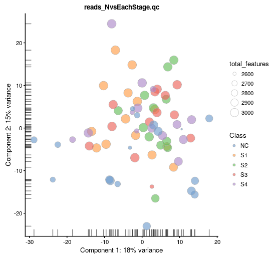
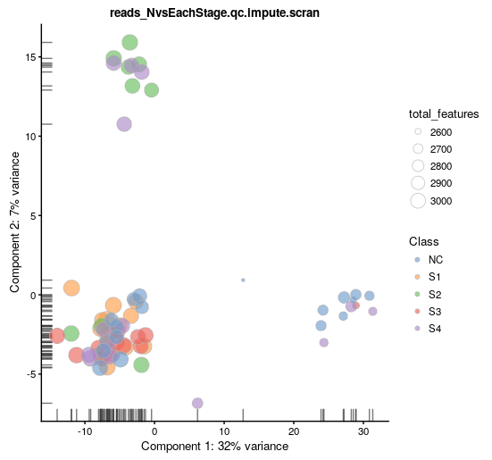
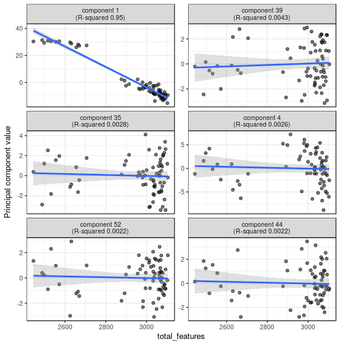

# 5. Imputation and confounders

## 5.1 Imputation

One of the main challenges when analyzing scRNA-seq data is the presence of zeros, or dropouts. The dropouts are assumed to have arisen for three possible reasons:

* The gene was not expressed in the sample and hence there are no transcripts to sequence
* The gene was expressed, but for some reason the transcripts were lost somewhere prior to sequencing
* The gene was expressed and transcripts were captured and turned into cDNA, but the sequencing depth was not sufficient to produce any reads.

In this chapter, we would like to use R package "scImpute" to preform imputation on expression matrix ([check paper](https://www.nature.com/articles/s41467-018-03405-7)).

first, we attached the R library and load the expression matrix after QC \(saved in last chapter\).

In this chapter, we only analyze the samples with batch information.

```r
library(SingleCellExperiment)
library(scater)
options(stringsAsFactors = FALSE)
setwd("./GSE71008")

reads_NvsEachStage.qc <- readRDS("GSE71008.reads_NvsEachStage.clean.batch.rds")
anno <- read.table("GSE71008.NvsCRC.annoWithBatch.txt", sep = "\t", header=T)
```

```r
head(anno)
  Individual        CancerType Stage Class RNA_Isolation_batch
1       s1S1 Colorectal_Cancer    1S    S1                  b2
2      s1S10 Colorectal_Cancer    1S    S1                  b3
3      s1S11 Colorectal_Cancer    1S    S1                  b3
4       s1S2 Colorectal_Cancer    1S    S1                  b2
5      s1S20 Colorectal_Cancer    1S    S1                  b7
6      s1S22 Colorectal_Cancer    1S    S1                  b8
  library_preparation_day gel_cut_size_selection
1                     l22                     g7
2                     l24                     g1
3                     l24                     g2
4                     l22                     g8
5                     l24                    g12
6                     l24                     g4
```

To use R package `scImpute`, we use the default parameters and takes a .csv or .txt file as an input:

```r
write.csv(counts(reads_NvsEachStage.qc), "GSE71008.reads_NvsEachStage.qc.rds.csv")
```

```r
 scimpute(
    count_path = "GSE71008.reads_NvsEachStage.qc.rds.csv", 
    infile = "csv", 
    outfile = "txt", 
    out_dir = "./", 
    Kcluster =5, 
    ncores = 2,  
    labeled = TRUE)

res.qc <- read.table("scimpute_count.txt")
reads_NvsEachStage.qc.impute <- SingleCellExperiment(assays = list(counts = as.matrix(res.qc)), colData = colData(reads_NvsEachStage.qc))
reads_NvsEachStage.qc.impute <- calculateQCMetrics(reads_NvsEachStage.qc.impute)
assay(reads_NvsEachStage.qc.impute, "logcounts_raw") <- log2(counts(reads_NvsEachStage.qc.impute) + 1) 
```

compare the difference before and after imputation

**raw data**
```r
plotPCA(
    reads_NvsEachStage.qc,
    exprs_values = "counts",
    colour_by = "Class",
    size_by = "total_features"
) + ggtitle("reads_NvsEachStage.qc")
```



**after imputation**
```r
plotPCA(
    reads_NvsEachStage.qc.impute,
    exprs_values = "counts",
    colour_by = "Class",
    size_by = "total_features"
) + ggtitle("reads_NvsEachStage.qc.impute")
```


then, we normalized the matrix using package `scran`

```r
library(scran)
​
# Cluster similar cells based on rank correlations in their gene expression profiles
qclust <- quickCluster(reads_NvsEachStage.qc.impute, min.size = 10)
​
# Methods to normalize single-cell RNA-seq data by deconvolving size factors from cell pools.
reads_NvsEachStage.qc.impute <- computeSumFactors(
    reads_NvsEachStage.qc.impute, 
    sizes = 10, 
    clusters = qclust
)
reads_NvsEachStage.qc.impute <- normalize(reads_NvsEachStage.qc.impute)
```

draw PCA plot

```r
plotPCA(
    reads_NvsEachStage.qc.impute,
    exprs_values = "logcounts",
    colour_by = "Class",
    size_by = "total_features"
) + ggtitle("reads_NvsEachStage.qc.impute.scran")
```



## 5.2 identify confounding factors

There is a large number of potential confounders, artifacts and biases in exRNA-seq data. One of the main challenges in analyzing exRNA-seq data stems from the fact that it is difficult to carry out a true technical replicate to distinguish biological and technical variability.

#### Correlations with PCs

Let’s first look again at the PCA plot of the QCed dataset:

```r
plotPCA(
    reads_NvsEachStage.qc.impute,
    exprs_values = "counts",
    colour_by = "RNA_Isolation_batch",
    size_by = "total_features"
) + ggtitle("reads_NvsEachStage.qc.impute")
```


`scater` allows one to identify principal components that correlate with experimental and QC variables of interest \(it ranks principle components by R^2 from a linear model regressing PC value against the variable of interest\).

Let’s test whether some of the variables correlate with any of the PCs.

**Detected genes**

```r
plotQC(
    reads_NvsEachStage.qc.impute,
    type = "find-pcs",
    exprs_values = "logcounts_raw",
    variable = "total_features"
)
```



Indeed, we can see that `PC1` can be almost completely explained by the number of detected genes. In fact, it was also visible on the PCA plot above. This is a well-known issue in scRNA-seq and was described [here](http://biorxiv.org/content/early/2015/12/27/025528).


**Explanatory variables**

`scater` can also compute the marginal R2R2 for each variable when fitting a linear model regressing expression values for each gene against just that variable, and display a density plot of the gene-wise marginal R^2 values for the variables.

```r
plotQC(
    reads_NvsEachStage.qc.impute,
    type = "expl",
    exprs_values = "logcounts",
    variables = c(
        "total_features",
        "total_counts",
        "RNA_Isolation_batch",
        "Class",
        "library_preparation_day"
    )
)
```


we founded that the "RNA_Isolation_batch" and "gel_cut_size_selection" have substantial explanatory power for many genes, so these variables are good candidates for conditioning out in a normalisation step.

## 5.3 Remove the confounders

Factors contributing to technical noise frequently appear as “batch effects” where samples processed on different days or by different technicians systematically vary from one another.

#### Remove Unwanted Variation (RUVSeq)
We will use the Remove Unwanted Variation (RUVSeq). Briefly, RUVSeq works as follows. For nn samples and JJ genes, consider the following generalized linear model (GLM), where the RNA-Seq read counts are regressed on both the known covariates of interest and unknown factors of unwanted variation:

* RUVg uses negative control genes (e.g. ERCCs), assumed to have constant expression across samples;

* RUVs uses centered (technical) replicate/negative control samples for which the covariates of interest are constant;

* RUVr uses residuals, e.g., from a first-pass GLM regression of the counts on the covariates of interest.

first, we need to construct one matrix to describe the sample class

```r
library(RUVSeq)
library(scRNA.seq.funcs)
​
scIdx <- matrix(-1, ncol = max(table(reads_NvsEachStage.qc.impute$Class)), nrow = 5)
tmp <- which(reads_NvsEachStage.qc.impute$Class == "S1")
scIdx[1, 1:length(tmp)] <- tmp
tmp <- which(reads_NvsEachStage.qc.impute$Class == "S2")
scIdx[2, 1:length(tmp)] <- tmp
tmp <- which(reads_NvsEachStage.qc.impute$Class == "S3")
scIdx[3, 1:length(tmp)] <- tmp
tmp <- which(reads_NvsEachStage.qc.impute$Class == "S4")
scIdx[4, 1:length(tmp)] <- tmp
tmp <- which(reads_NvsEachStage.qc.impute$Class == "NC")
scIdx[5, 1:length(tmp)] <- tmp
```

```r
scIdx
     [,1] [,2] [,3] [,4] [,5] [,6] [,7] [,8] [,9] [,10] [,11] [,12] [,13] [,14]
[1,]    1    2    3    4    5    6    7    8    9    10    11    12    13    14
[2,]   15   16   17   18   19   20   21   22   23    24    25    26    -1    -1
[3,]   27   28   29   30   31   32   33   34   35    36    37    38    39    -1
[4,]   40   41   42   43   44   45   46   47   48    49    50    51    52    53
[5,]   54   55   56   57   58   59   60   61   62    63    64    65    66    67
     [,15] [,16] [,17]
[1,]    -1    -1    -1
[2,]    -1    -1    -1
[3,]    -1    -1    -1
[4,]    -1    -1    -1
[5,]    68    69    70

```

then, we remove the confounders for each genes

```r
cIdx <- rownames(reads_NvsEachStage.qc.impute)

```

One key factor `k` is needed to be set: The number of factors of unwanted variation to be estimated from the data.

```r
# num. of factor = 1
ruvs <- RUVs(
    logcounts(reads_NvsEachStage.qc.impute), 
    cIdx, 
    k = 1, 
    scIdx = scIdx, 
    isLog = TRUE
)
assay(reads_NvsEachStage.qc.impute, "ruvs1") <- ruvs$normalizedCounts
​
# num. of factor = 5
ruvs <- RUVs(
    logcounts(reads_NvsEachStage.qc.impute), 
    cIdx, 
    k = 5, 
    scIdx = scIdx, 
    isLog = TRUE
)
assay(reads_NvsEachStage.qc.impute, "ruvs5") <- ruvs$normalizedCounts
​
# num. of factor = 10
ruvs <- RUVs(
    logcounts(reads_NvsEachStage.qc.impute), 
    cIdx, 
    k = 10, 
    scIdx = scIdx, 
    isLog = TRUE
)
assay(reads_NvsEachStage.qc.impute, "ruvs10") <- ruvs$normalizedCounts
​
# num. of factor = 20
ruvs <- RUVs(
    logcounts(reads_NvsEachStage.qc.impute), 
    cIdx, 
    k = 20, 
    scIdx = scIdx, 
    isLog = TRUE
)
assay(reads_NvsEachStage.qc.impute, "ruvs20") <- ruvs$normalizedCounts
​
# num. of factor = 25
ruvs <- RUVs(
    logcounts(reads_NvsEachStage.qc.impute), 
    cIdx, 
    k = 25, 
    scIdx = scIdx, 
    isLog = TRUE
)
assay(reads_NvsEachStage.qc.impute, "ruvs25") <- ruvs$normalizedCounts

```

Here we show the differences in different k values


#### Evaluate and compare confounder removal strategies

We consider three different metrics which are all reasonable based on our knowledge of the experimental design. Depending on the biological question that you wish to address, it is important to choose a metric that allows you to evaluate the confounders that are likely to be the biggest concern for the given situation.

**Method 1: tSNE/PCA plot**

We evaluate the effectiveness of the normalization by inspecting the PCA plot where colour corresponds the technical replicates and shape corresponds to different biological samples. Separation of biological samples and interspersed batches indicates that technical variation has been removed.

```r
pdf("GSE71008.reads_NvsEachStage.remove_confounders.pca_Batch.pdf")
for(n in assayNames(reads_NvsEachStage.qc.impute)) {
    print(
        plotPCA(
            reads_NvsEachStage.qc.impute,
            colour_by = "RNA_Isolation_batch",
            size_by = "total_features",
            shape_by = "library_preparation_day",
            exprs_values = n
        ) +
        ggtitle(n)
    )
}
dev.off()
```


**Method 2: RLE plot**

We can also examine the effectiveness of correction using the relative log expression (RLE) across samples to confirm technical noise has been removed from the dataset. Note RLE only evaluates whether the number of genes higher and lower than average are equal for each samples - i.e. systemic technical effects. Random technical noise between batches may not be detected by RLE.

```r
pdf("GSE71008.reads_NvsEachStage.remove_confounders.plotRLE.pdf")
res <- list()
for(n in assayNames(reads_NvsEachStage.qc.impute)) {
    res[[n]] <- suppressWarnings(calc_cell_RLE(assay(reads_NvsEachStage.qc.impute, n)))
}
par(mar=c(6,4,1,1))
boxplot(res, las=2)
dev.off()
```


**Method 3: QC plot**

```r
pdf("GSE71008.reads_NvsEachStage.remove_confounders.plotQC.pdf")
for(n in assayNames(reads_NvsEachStage.qc.impute)) {
    print(
        plotQC(
            reads_NvsEachStage.qc.impute,
            type = "expl",
            exprs_values = n,
            variables = c(
                "total_features",
                "total_counts",
                "RNA_Isolation_batch",
                "Class",
                "library_preparation_day"
            )
        ) +
        ggtitle(n)
    )
}
dev.off()
```


# Scripts and Code

[https://github.com/lulab/training/tree/master/proj_exRNA/example_small/denoise](https://github.com/lulab/training/tree/master/proj_exRNA/example_small/denoise)

# Software/Packages

R: [scImpute](https://github.com/Vivianstats/scImpute)

scImpute is developed to accurately and robustly impute the dropout values in scRNA-seq data. scImpute can be applied to raw read count matrix before the users perform downstream analyses.

R: [RUVSeq](https://bioconductor.org/packages/release/bioc/html/RUVSeq.html)

This package implements the remove unwanted variation (RUV) methods of Risso et al. (2014) for the normalization of RNA-Seq read counts between samples.

# References
[Wei Vivian Li & Jingyi Jessica Li (2018) “An accurate and robust imputation method scImpute for single-cell RNA-seq data” Nature Communications volume 9: 997. doi:10.1038/s41467-018-03405-7](https://www.nature.com/articles/s41467-018-03405-7)

[Risso D, Ngai J, Speed T, Dudoit S (2014). “Normalization of RNA-seq data using factor analysis of control genes or samples.” Nature Biotechnology, 32(9), 896–902.](https://www.nature.com/articles/nbt.2931)

